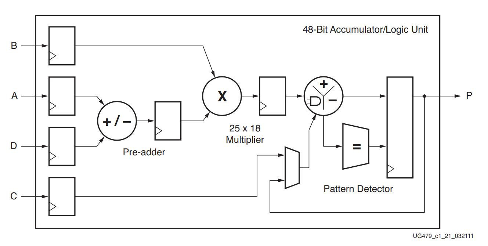

# Overview
## Goal
I wanted to work on a fun project to get reacquainted with digital logic design with FPGAs. I've been taught VHDL in university but hadn't used it since. I remember it being quite fun and I love the idea of configurable circuits to speed up application-specific calculations.

## Project
For the project I chose something related to my interests. I have a digital piano which I love to play. There are countless YouTube videos where a video of falling notes is overlaid above the keys. I wanted to make this as a hardware project.
The easiest and most reliable way would be to hook something up to the MIDI output of the digital piano. This would be the best because then the keys of the piano can communicate exactly when a key is pressed and released, so all that follows is redirecting this to LEDs in the correct format. Since this would be too easy and too small of a project, I decided to go for a different approach.
I chose to use a microphone to try and extract the keys from there. This would require me to implement and get familiar with the I2S protocol which I've heard of before, and use some signal processing which has also been a while since I've touched it.
The FPGA I chose for this project was the Xilinx Artix7 on the Basys3 development board by Digilent. This seemed to be a more than powerful enough device with a clean development environment.

# IO
## Input: I2S Microphone
The audio was acquired with an I2S microphone. This was actually way easier than I expected.
As inputs the microphone needs a select signal (WS), used for multiplexing two stereo mics, and a clock signal (BCLK). The bit clock determines the sampling rate and thus the Nyquist frequency of the signal. I chose 2.5MHz and with 64 clocks per sample, this results in 39,062 samples per second. Not quite reaching the Nyquist frequency of 20kHz for the upper range of human hearing, but still more than sufficient.
The bits of the digital sample are output by the I2S slave at 1 bit per clock when the slave is selected by the WS signal. There are 24 bit in the sample, the remaining 8 bits are not valid.
There are some tricky off-by-one things, but it is all really well explained in datasheets or even Wikipedia. Writing the driver was straightforward.

## Output: sk6812
I used an LED strip to output the *detected* pressed keys. The idea here was to line up the LEDs with the correct key, and light up as long as the key is pressed.
Most LED strips use a serial protocol where each led is daisy-chained after each other. The master sends a start symbol followed by a sequence of RGBW values. Every led passes on the start sequence to the next one, consumes the first RGBW value it receives and only passes on the subsequent values.
This makes the protocol extremely simple. There's no need for addressing and only a few wires are required. The downside is that the refresh rate decreases the more LEDs are chained together.
I struggled a bit here since the LEDs I used didn't mention there was a **W**, only RGB. I figured this out by inspecting the output of the first LED with an oscilloscope and noticed it truncated an extra 8 bits on every link of the chain.

# Processing
## FFT
I started off with an DTFT to extract to frequencies present in the signal.
Coding the FFT by hand would've too difficult and a bit out-of-scope for this project but luckily (and obviously) Xilinx has an FFT IP core ready to use. It took a while to get this working, especially since debugging stuff is really hard in FPGA land. But I managed to communicate through the AXI Stream interface and quickly ran into fundamental problems I knew I would encounter.

### Advantage
The time-complexity of the FFT is well-known to be $Nlog(N)$ where $N$ is the amount of samples per window.  This really efficient compared to a naïve implementation of the DTFT where each sample requires $N$ multiplications and N additions (when the twiddle factors are constants calculated in advance).

### Issues
- Due to how our ear works, the frequencies of notes are distributed exponentially [^1]. This means we need to cover both a large range: 27.5Hz - 4186Hz, and small frequency resolution: the difference of the frequencies between the two lowest notes is ~2Hz.
   In the best case we can downsample to ~8.2kHz to still capture the highest frequency, and then we'd need at least $\frac{8200}{2} = 4100$  samples in the DTFT for the frequency resolution.
   This would mean a delay of $\frac{4100}{8200\textrm{Hz}}=0.5\textrm{s}$ before any note would show up in the LEDs. This is unacceptably slow.
   The fundamental issue here is that for the DTFT, the frequency resolution is determined by the sample count, but in the FFT this frequency resolution is the same for all frequencies. There is much more space in-between the upper frequencies which we can and should make us of to be faster.
- The Xilinx FFT IP requires N to be a power of two.  This limits our flexibility in choosing N immensely. The allowed sizes are likely more of a concern in the FPGA world than in software.
- N samples are processed at once and thus need the respective resources. 

## FPGA Superpowers
The instinct to reach for the FFT and discussing the time-complexity came from my experience as a software engineer. The nature of an FPGA allows us to do much more interesting stuff though.

The power of an FPGA lies in its ability to do **a lot** of work in parallel. Whenever you're designing something for FPGAs this should be exploited: we can calculate the DTFT for every frequency of interest individually at the same time! This decouples the investigated frequencies from the frequency resolution.

Turns out there's even a really nice algorithm to calculate this: the Goertzel algorithm. It's a FIR filter where we need to store only two past states, precalculate just one factor and if we're only interested in the power spectrum (we are [^2]), we need only real math which simplifies the logic a whole lot.

### Choosing N
We now have to choose the amount of samples N for each frequency. Its value is subject to three constraints.
 1. The frequency-of-interest $f_i = k\frac{f_s}{N}$ is a multiple of the sampling frequency over $N$. We should choose $k$ and $N$ to closely match our $f_i$. For high accuracy we want N to be large.
2. The DFT does not calculate the power of just a single frequency, but rather the contribution of region multiplied with the particular DFT window weighing. This weighing for a rectangular window can be seen here:  For larger N, the range of influencing frequencies becomes smaller. For high precision we want N to be large.
3. For a quick response to changes we want N to be small!

I created a python script to determine $k$ and $N$ for me and export it to VHDL arrays. It determines them both based on an arbitrary required accuracy for $f_i$ and the known spacing between the frequencies of adjacent keys.
### Goertzel implementation

Instantiating 88 Goertzels also wasn't without difficulties.

The math operations take up a lot of resources. There are dedicated [DSP48E1](https://docs.xilinx.com/v/u/en-US/ug479_7Series_DSP48E1) slices that are meant to be used for math.

The Artix7 XZ7A35T of the Basys 3 board has a total of 90 DSP slices. This is just enough to use one slice per Goertzel, constraining the size of the inputs to 18 bits for the multiply.
This is such a close fit (88 out of 90) but the constituent operations of the Goertzel have to be pipelined anyway for timing and we have loads of time between incoming samples so I went for the extra challenge of sharing a limited amount of the DSP slices between the notes.

The Goertzel update step is $$s[n] = x[n] + Cs[n-1]-s[n-2]$$ with $s[-2] = s[-1] = 0$. The constant $C = 2cos(\omega_0)$ is precalculated and $\omega_0$ is the frequency-of-interest in radians per sample.
This step consists of 1 multiply and 2 additions, so we'll need an FSM to pipeline the operations to satisfy the timing and ensure resource reuse.

We can share the multipliers by hoisting them out of the Goertzel algorithm and passing their signal in as a parameter instead. I've also created an arbiter which sends an enable signal to the sharing Goertzel in succession and muxes their inputs to the multiplier, advancing once the current one is finished.

- The I2S frequency is $100\textrm{Mhz} \,/\, 40 \,/\, 64$ ~ $40\textrm{kHz}$ so we have 60$ clocks per sample which is plenty.
- There's extra processing to finish up the power calculation after the Goertzel update step of the final sample. The processing time of this last sample is 165 cycles. This was difficult to calculate since I couldn't find any references to latency in the documentation, but experimented to confirm..
- 2560 / 165 = 15.5151 or one multiplier can serve at most 15 Goertzels if they were all to finish on the same sample. This is obviously rarely going to occur, and with a smart allocation of frequencies to Goertzel bins this could be guaranteed never to happen.
- The smart allocation is when the number of samples for each frequency are carefully chosen such that the pairwise gcds are large and the starts of the goertzels are offset such that the maximum amount of simultaneous "end" samples in the same clock cycle are kept low.

The product of this sharing exercise is something in between an ALU and pure parallel. There are multiple add/mul ports that are shared between *tasks*.

## Result
Here is a demonstration of the final result.

[working.webm](https://github.com/mennovf/fpga-led-keys/assets/1986792/f721b140-8fd7-472c-91e5-4d8e70494aa9)

There are some defects in this video that are immediately obvious. The main one is that often multiple LEDs light up when only key is being played. The first reason for this is that producing a note on a stringed instrument creates harmonics, which are integer multiples of the fundamental frequency. In many cases there is still enough energy in these harmonics to light up their associated LED.
I implemented a crude correction of this by subtracting a fraction of the calculated power from the next octave up. The result is slightly better.

[better.webm](https://github.com/mennovf/fpga-led-keys/assets/1986792/ff3585db-1b89-489b-9385-cebcc27f3337)

# Shortcomings or further work
The result is far from perfect but since this is not meant as a polished project but just an excuse to learn, I'm not going to develop it further. These are some of the known shortcomings:
1. **Loudness**. The device is meant to display key presses to a human, so it should *react* whenever a human would react. Our hearing is far from constant. We perceive the volume of sounds different in function of their frequency. The same dependence should be implemented here to mimic to our ears.
   This is probably most easily achieved with an array of predefined constant to multiply with the output of the Goertzels.
2. **Piano notes are not frequencies**. Stringed instruments such as violins have a much cleaner spectrum than a piano. This is caused by the mechanism of the piano itself. Violins are bowed and receive a steady supply of energy to maintain the vibration. A piano key delivers an impulse to the strings via a hammer and is quickly dampened with a cushion once the key is released. Both devices introduce higher frequencies which are not accounted for and will be perceived as higher notes in my naïve device.
3. The Goertzel core is prime candidate for High-Level Synthesis. I might get around to this later.
# Lessons and questions
I would love to know if there is anything I could have implemented more efficiently or whether there are best practices for the stuff I've done. Especially about the sharing of resources.

[^1]:  $\textrm{freq}(\textrm{note}) \sim K \exp(\textrm{note})$ for some $K$.
[^2]:  [Sound intensity is proportional to the square of the measured pressure](https://www.sfu.ca/~gotfrit/ZAP_Sept.3_99/s/sound_pressure.html)
